# LexGuard

**Adversarial Multi-Agent AI for Contract Intelligence**


LexGuard is an AI-powered contract analysis platform that uses three adversarial Gemini 2.5 Flash agents working in sequence to detect exploitative clauses, verify findings, and simulate worst-case consequences. Unlike single-prompt summarizers, LexGuard's adversarial design — two agents arguing about the same document — catches edge cases a single pass would miss.

> **Screenshot: Hero / Landing Page**
>
> 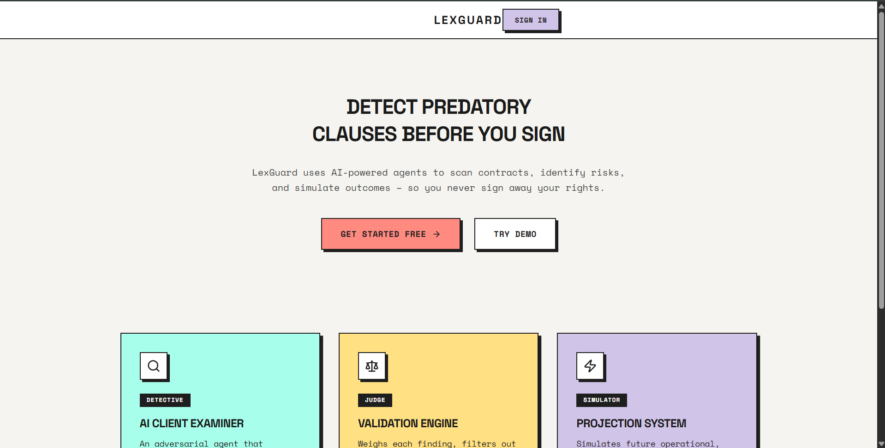

---

## Table of Contents

- [Features](#features)
- [Screenshots](#screenshots)
- [System Architecture](#system-architecture)
- [Tech Stack](#tech-stack)
- [Getting Started](#getting-started)
- [Environment Variables](#environment-variables)
- [Project Structure](#project-structure)
- [Database Schema](#database-schema)
- [API Reference](#api-reference)
- [Deployment](#deployment)
- [Design System](#design-system)
- [License](#license)

---

## Features

- **3-Agent Adversarial Pipeline** — Detective hunts risky clauses, Judge verifies and scores them, Simulator generates worst-case narratives
- **Multi-Format Upload** — Drag-and-drop PDF, DOCX, or paste raw text (up to 20K characters)
- **Risk Scoring** — Quantified 0-100 risk score with severity breakdown (Critical / High / Medium / Low)
- **Clause Highlighting** — Predatory clauses marked directly on the contract text with color-coded severity
- **Worst-Case Simulator** — On-demand second-person consequence stories for high-risk clauses
- **OAuth + Credentials Auth** — Sign in with Google, GitHub, or email/password via NextAuth v5
- **User Profiles** — Avatar upload, editable name, plan management, password change
- **Contract Management** — Grid/list views, search, sort, filter by risk level
- **Data Export** — Download all analyses as JSON
- **Plans & Pricing** — Free tier (10 analyses/day) and Pro tier ($5/month, unlimited)
- **Responsive Design** — Neo-brutalist UI with Tailwind CSS v4, print-ready reports

---

## Screenshots

> **Dashboard — Recent analyses, risk overview, quick stats**
>
> 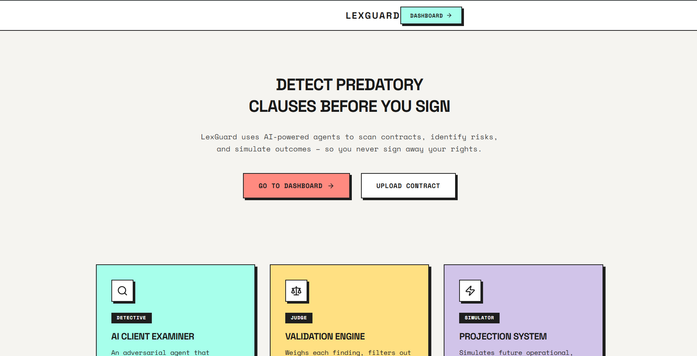

> **Upload — Drag-and-drop PDF/DOCX or paste contract text**
>
> 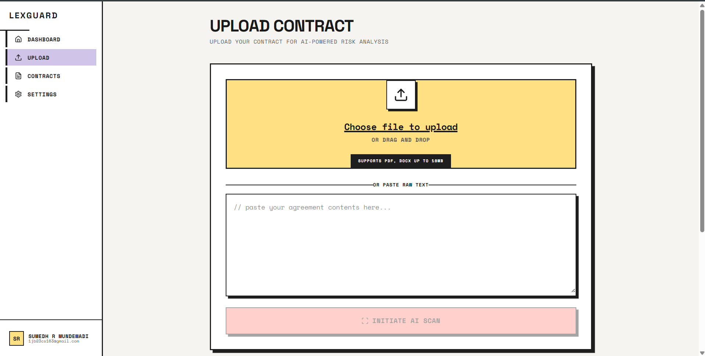

> **Analysis Detail — Two-pane risk workbench with clause highlighting**
>
> 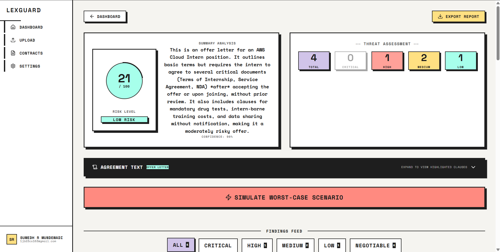

> **Contracts — Grid/list view, search, filter by risk level**
>
> 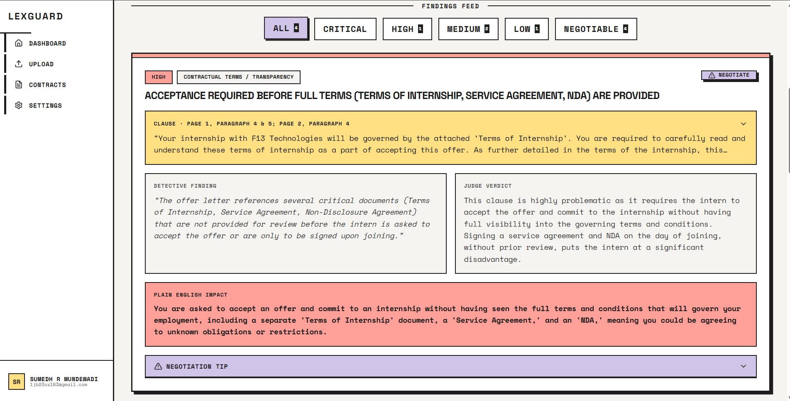

> **Worst-Case Simulator — AI-generated consequence narratives**
>
> 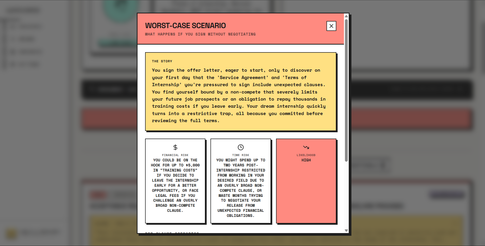

> **Profile — Avatar, plan, auth provider, password management**
>
> 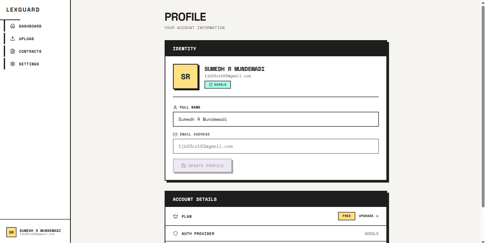

> **Plans & Pricing — Free vs Pro tier comparison**
>
> 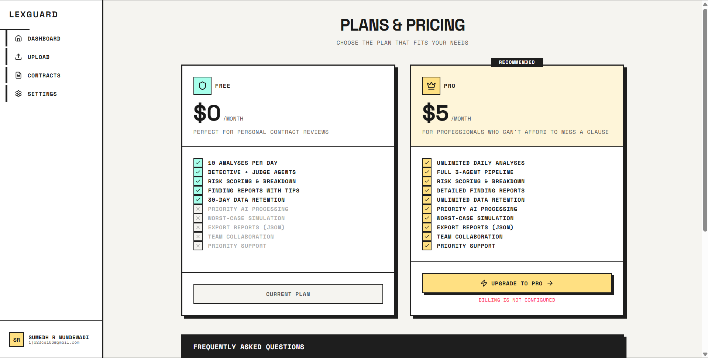

> **Sign In — OAuth (Google, GitHub) + credentials**
>
> 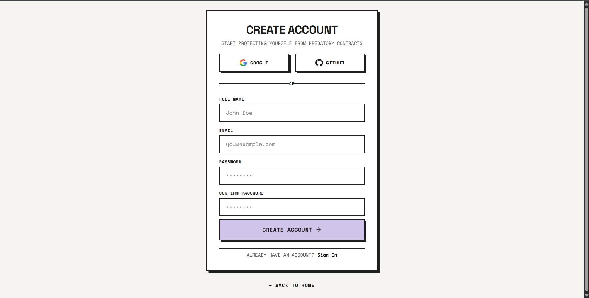

---

## System Architecture

> **System Design Diagram**
>
> 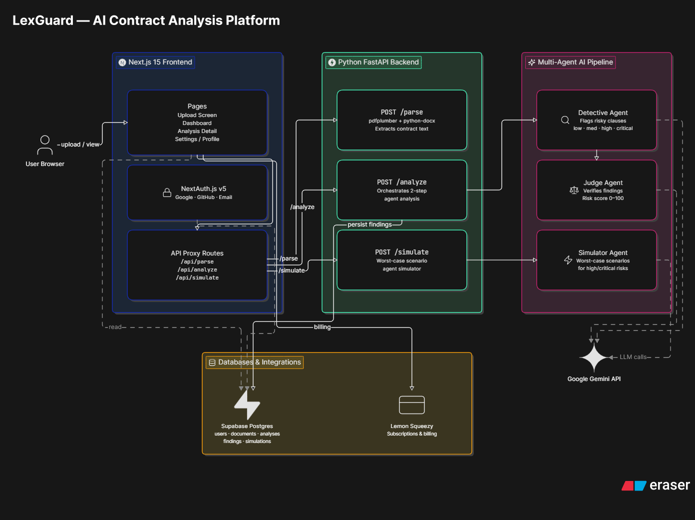

<details>
<summary><b>Mermaid source (click to expand)</b></summary>

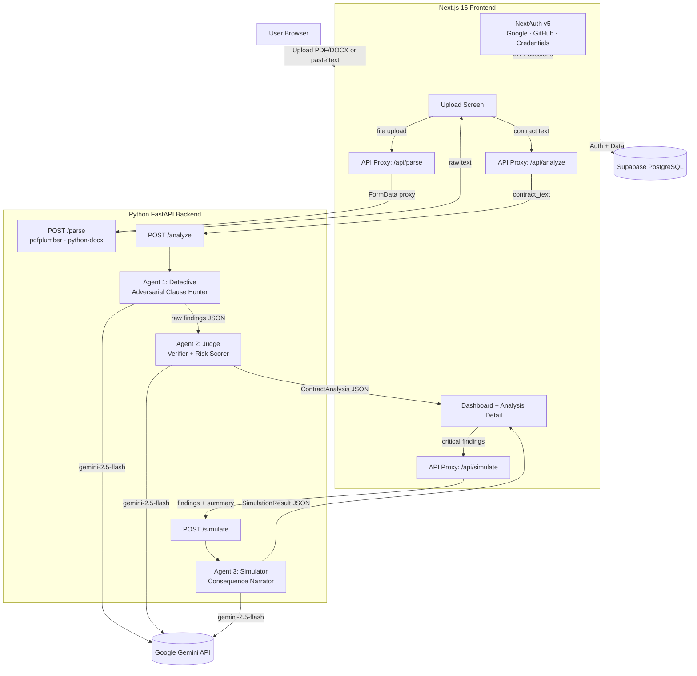

</details>

### Agent Pipeline

| Agent | File | Role | Temp | Output |
|---|---|---|---|---|
| **Detective** | `backend/detective.py` | Scans for every clause that could harm the signer. Classifies into 13 risk categories. | 0.1 | Raw `Finding[]` |
| **Judge** | `backend/judge.py` | Independently verifies each finding against the source. Confirms, upgrades, downgrades, or dismisses. Computes risk score. | 0.1 | Full `ContractAnalysis` |
| **Simulator** | `backend/simulate.py` | Generates vivid worst-case consequence stories for critical/high findings. | 0.7 | `SimulationResult` |

### Risk Scoring Formula

```
overall_risk_score = min(CRITICAL x 25 + HIGH x 10 + MEDIUM x 5 + LOW x 1, 100)
```

| Score | Level |
|---|---|
| 0 - 19 | SAFE |
| 20 - 39 | LOW |
| 40 - 59 | MEDIUM |
| 60 - 79 | HIGH |
| 80 - 100 | CRITICAL |

---

## Tech Stack

| Layer | Technology | Purpose |
|---|---|---|
| Frontend | **Next.js 16** + **React 19** | App Router, SSR, API proxies |
| Styling | **Tailwind CSS v4** | Utility-first CSS, neo-brutalist design system |
| Auth | **NextAuth v5** | Google, GitHub, Credentials providers (JWT sessions) |
| Icons | **Lucide React** | UI icon set |
| File Upload | **react-dropzone** | Drag-and-drop interface |
| Backend | **FastAPI** | REST API, agent orchestration |
| AI | **Gemini 2.5 Flash** | All three agents via `google-genai` SDK |
| Database | **Supabase** (PostgreSQL) | Users, documents, analyses, findings, simulations |
| Deployment | **Google Cloud Run** | Single-container Docker (Node 22 + Python 3.11) |

---

## Getting Started

### Prerequisites

- **Node.js** >= 22
- **Python** >= 3.11
- **npm** (comes with Node.js)
- A **Google Gemini API key** ([Get one here](https://aistudio.google.com/app/apikey))
- A **Supabase** project ([Create one here](https://supabase.com))

### 1. Clone the repository

```bash
git clone https://github.com/your-username/lexguard.git
cd lexguard
```

### 2. Install frontend dependencies

```bash
npm install
```

### 3. Install backend dependencies

```bash
cd backend
pip install -r requirements.txt
cd ..
```

### 4. Set up environment variables

Create a `.env.local` file in the project root:

```bash
cp .env.example .env.local
# Edit .env.local with your actual keys (see Environment Variables section)
```

### 5. Start the development servers

**Terminal 1 — Backend:**
```bash
cd backend
uvicorn main:app --host 0.0.0.0 --port 8000 --reload
```

**Terminal 2 — Frontend:**
```bash
npm run dev
```

Open [http://localhost:3001](http://localhost:3001) in your browser.

---

## Environment Variables

Create a `.env.local` file with the following:

```env
# Google Gemini
GEMINI_API_KEY=your_gemini_api_key

# Python backend URL
BACKEND_URL=http://localhost:8000

# NextAuth.js
NEXTAUTH_URL=http://localhost:3001
NEXTAUTH_SECRET=generate-with-openssl-rand-base64-32

# Google OAuth
GOOGLE_CLIENT_ID=your_google_client_id
GOOGLE_CLIENT_SECRET=your_google_client_secret

# GitHub OAuth
GITHUB_CLIENT_ID=your_github_client_id
GITHUB_CLIENT_SECRET=your_github_client_secret

# Supabase
NEXT_PUBLIC_SUPABASE_URL=https://your-project.supabase.co
NEXT_PUBLIC_SUPABASE_ANON_KEY=your_anon_key
SUPABASE_SERVICE_ROLE_KEY=your_service_role_key
```

---

## Project Structure

```
lexguard/
├── app/
│   ├── (marketing)/
│   │   └── page.tsx                  # Landing page
│   ├── (app)/
│   │   ├── layout.tsx                # Authenticated layout with sidebar
│   │   ├── dashboard/page.tsx        # Dashboard — recent analyses, stats
│   │   ├── upload/page.tsx           # Contract upload screen
│   │   ├── contracts/page.tsx        # Contract list — grid/list, search, filter
│   │   ├── analysis/[id]/page.tsx    # Analysis detail — two-pane risk workbench
│   │   ├── profile/page.tsx          # User profile — avatar, plan, password
│   │   ├── settings/page.tsx         # Settings — theme, export, delete account
│   │   └── plans/page.tsx            # Plans & pricing
│   ├── auth/
│   │   ├── signin/page.tsx           # Sign in (OAuth + credentials)
│   │   └── signup/page.tsx           # Sign up (email + password)
│   ├── api/
│   │   ├── analyze/route.ts          # Proxy → backend /analyze + persist to DB
│   │   ├── parse/route.ts            # Proxy → backend /parse
│   │   ├── simulate/route.ts         # Proxy → backend /simulate
│   │   ├── analyses/
│   │   │   ├── route.ts              # GET all user analyses
│   │   │   └── [id]/route.ts         # GET/DELETE single analysis
│   │   ├── auth/signup/route.ts      # Credentials signup
│   │   └── user/
│   │       ├── profile/route.ts      # GET/PATCH/DELETE user profile
│   │       ├── password/route.ts     # PATCH password
│   │       └── export/route.ts       # GET data export (JSON)
│   ├── globals.css                   # Design system + Tailwind imports
│   └── layout.tsx                    # Root layout
├── components/
│   ├── ContractUpload.tsx            # Drag-drop + paste textarea
│   ├── FindingCard.tsx               # Clause card (severity, verdict, tips)
│   ├── FindingsList.tsx              # Filtered + sorted findings
│   ├── RiskScoreBadge.tsx            # SVG circular risk meter (0-100)
│   ├── SimulatePanel.tsx             # Worst-case scenario panel
│   ├── SummaryStats.tsx              # Severity count breakdown
│   └── layout/
│       ├── Sidebar.tsx               # Navigation sidebar
│       └── UserMenu.tsx              # User dropdown menu
├── lib/
│   ├── auth.ts                       # NextAuth v5 config + JWT callbacks
│   ├── constants.ts                  # Route constants
│   └── supabase/
│       └── server.ts                 # Supabase server client
├── types/
│   └── analysis.ts                   # Shared TypeScript interfaces
├── backend/
│   ├── main.py                       # FastAPI app, CORS, endpoints
│   ├── parser.py                     # PDF + DOCX + plaintext extraction
│   ├── detective.py                  # Agent 1: clause hunter
│   ├── judge.py                      # Agent 2: verifier + scorer
│   ├── simulate.py                   # Agent 3: consequence narrator
│   ├── gemini_client.py              # Gemini API client wrapper
│   └── requirements.txt              # Python dependencies
├── middleware.ts                      # Route protection (auth redirects)
├── Dockerfile                        # Multi-stage build (Node 22 + Python 3.11)
├── start.sh                          # Container entrypoint (backend + frontend)
├── next.config.ts                    # Next.js config (standalone output, 20MB body limit)
└── ARCHITECTURE.md                   # Detailed architecture document
```

---

## Database Schema

> **Entity-Relationship Diagram**
>
> 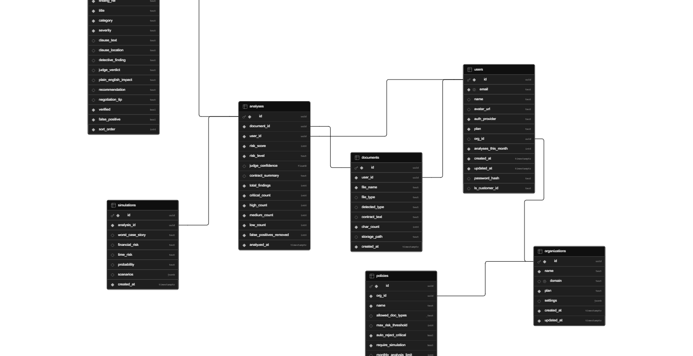

## Table `organizations`

### Columns

| Name | Type | Constraints |
|------|------|-------------|
| `id` | `uuid` | Primary |
| `name` | `text` |  |
| `domain` | `text` |  Nullable Unique |
| `plan` | `text` |  |
| `settings` | `jsonb` |  Nullable |
| `created_at` | `timestamptz` |  |
| `updated_at` | `timestamptz` |  |

## Table `users`

### Columns

| Name | Type | Constraints |
|------|------|-------------|
| `id` | `uuid` | Primary |
| `email` | `text` |  Unique |
| `name` | `text` |  Nullable |
| `avatar_url` | `text` |  Nullable |
| `auth_provider` | `text` |  |
| `plan` | `text` |  |
| `org_id` | `uuid` |  Nullable |
| `analyses_this_month` | `int4` |  |
| `created_at` | `timestamptz` |  |
| `updated_at` | `timestamptz` |  |
| `password_hash` | `text` |  Nullable |
| `ls_customer_id` | `text` |  Nullable |

## Table `documents`

### Columns

| Name | Type | Constraints |
|------|------|-------------|
| `id` | `uuid` | Primary |
| `user_id` | `uuid` |  |
| `file_name` | `text` |  |
| `file_type` | `text` |  Nullable |
| `detected_type` | `text` |  Nullable |
| `contract_text` | `text` |  Nullable |
| `char_count` | `int4` |  |
| `storage_path` | `text` |  Nullable |
| `created_at` | `timestamptz` |  |

## Table `analyses`

### Columns

| Name | Type | Constraints |
|------|------|-------------|
| `id` | `uuid` | Primary |
| `document_id` | `uuid` |  |
| `user_id` | `uuid` |  |
| `risk_score` | `int4` |  |
| `risk_level` | `text` |  |
| `judge_confidence` | `float8` |  Nullable |
| `contract_summary` | `text` |  Nullable |
| `total_findings` | `int4` |  |
| `critical_count` | `int4` |  |
| `high_count` | `int4` |  |
| `medium_count` | `int4` |  |
| `low_count` | `int4` |  |
| `false_positives_removed` | `int4` |  |
| `analyzed_at` | `timestamptz` |  |

## Table `findings`

### Columns

| Name | Type | Constraints |
|------|------|-------------|
| `id` | `uuid` | Primary |
| `analysis_id` | `uuid` |  |
| `finding_ref` | `text` |  |
| `title` | `text` |  |
| `category` | `text` |  |
| `severity` | `text` |  |
| `clause_text` | `text` |  Nullable |
| `clause_location` | `text` |  Nullable |
| `detective_finding` | `text` |  Nullable |
| `judge_verdict` | `text` |  Nullable |
| `plain_english_impact` | `text` |  Nullable |
| `recommendation` | `text` |  Nullable |
| `negotiation_tip` | `text` |  Nullable |
| `verified` | `bool` |  |
| `false_positive` | `bool` |  |
| `sort_order` | `int4` |  |

## Table `simulations`

### Columns

| Name | Type | Constraints |
|------|------|-------------|
| `id` | `uuid` | Primary |
| `analysis_id` | `uuid` |  |
| `worst_case_story` | `text` |  Nullable |
| `financial_risk` | `text` |  Nullable |
| `time_risk` | `text` |  Nullable |
| `probability` | `text` |  Nullable |
| `scenarios` | `jsonb` |  Nullable |
| `created_at` | `timestamptz` |  |

## Table `policies`

### Columns

| Name | Type | Constraints |
|------|------|-------------|
| `id` | `uuid` | Primary |
| `org_id` | `uuid` |  |
| `name` | `text` |  |
| `allowed_doc_types` | `_text` |  Nullable |
| `max_risk_threshold` | `int4` |  Nullable |
| `auto_reject_critical` | `bool` |  |
| `require_simulation` | `bool` |  |
| `monthly_analysis_limit` | `int4` |  Nullable |
| `is_active` | `bool` |  |
| `created_at` | `timestamptz` |  |
| `updated_at` | `timestamptz` |  |


## API Reference

### FastAPI Backend

| Method | Endpoint | Description |
|---|---|---|
| `GET` | `/health` | Health check |
| `POST` | `/parse` | Extract text from PDF/DOCX (`multipart/form-data`) |
| `POST` | `/analyze` | Run Detective + Judge pipeline (`{ contract_text }`) |
| `POST` | `/simulate` | Run Simulator on findings (`{ findings, contract_summary }`) |

### Next.js API Routes

| Method | Endpoint | Description |
|---|---|---|
| `POST` | `/api/parse` | Proxy to backend `/parse` |
| `POST` | `/api/analyze` | Proxy to backend `/analyze` + persist to Supabase |
| `POST` | `/api/simulate` | Proxy to backend `/simulate` |
| `GET` | `/api/analyses` | List all analyses for authenticated user |
| `GET` | `/api/analyses/:id` | Get single analysis with findings |
| `DELETE` | `/api/analyses/:id` | Delete analysis and associated data |
| `POST` | `/api/auth/signup` | Register with email + password |
| `GET` | `/api/user/profile` | Get user profile |
| `PATCH` | `/api/user/profile` | Update name / avatar |
| `DELETE` | `/api/user/profile` | Delete account + all data |
| `PATCH` | `/api/user/password` | Change password (credentials users) |
| `GET` | `/api/user/export` | Export all user data as JSON |

---

## Deployment

### Google Cloud Run (Production)

LexGuard ships as a **single Docker container** running both the Next.js frontend and FastAPI backend, managed by a shell script entrypoint.

```bash
# Set your project
PROJECT_ID=$(gcloud config get-value project)

# Build and push the container
gcloud builds submit . --tag gcr.io/$PROJECT_ID/lexguard

# Deploy to Cloud Run
gcloud run deploy lexguard \
  --image gcr.io/$PROJECT_ID/lexguard \
  --platform managed \
  --region us-central1 \
  --allow-unauthenticated \
  --memory 1Gi \
  --cpu 2 \
  --timeout 120 \
  --set-env-vars "\
GEMINI_API_KEY=your_key,\
NEXTAUTH_URL=https://your-service-url.run.app,\
NEXTAUTH_SECRET=your_secret,\
GOOGLE_CLIENT_ID=your_id,\
GOOGLE_CLIENT_SECRET=your_secret,\
GITHUB_CLIENT_ID=your_id,\
GITHUB_CLIENT_SECRET=your_secret,\
NEXT_PUBLIC_SUPABASE_URL=https://your-project.supabase.co,\
NEXT_PUBLIC_SUPABASE_ANON_KEY=your_anon_key,\
SUPABASE_SERVICE_ROLE_KEY=your_service_role_key"
```

### Alternative: Split Deployment

| Component | Platform | Notes |
|---|---|---|
| Frontend | **Vercel** | Zero-config Next.js hosting. Set `BACKEND_URL` env var. |
| Backend | **Render** | Connect repo, set `GEMINI_API_KEY`. Auto-detects Dockerfile. |

```bash
# Deploy frontend to Vercel
npm i -g vercel && vercel --prod

# Backend on Render: connect repo via dashboard
# Set env: GEMINI_API_KEY=your_key
```

---

## Design System

LexGuard speaks one opinionated visual language — **Retro Neo-Brutalism** — applied consistently across every screen, badge, and report. The intent is a tactile, high-contrast interface where structure is always visible and nothing hides behind soft gradients or blur.

**Core principles**

- **Borders** — Hard `2px` solid ink borders on every container; zero border-radius (sharp corners only)
- **Shadows** — Offset hard drop shadows on a `4px → 5px → 6px` scale (e.g. `5px 5px 0px 0px #1a1a1a`), never blurred
- **Typography** — `Space Grotesk` (bold, uppercase) for headings, `Space Mono` for body copy and accents
- **Motion** — Interactive elements translate along the shadow axis for a physical press-down feel, rather than fading
- **Dark mode** — A full design-token swap: ink canvas, bright-chalk borders, and neon-shifted accent colors

**Color palette**

| Swatch | Color | Hex | Usage |
|---|---|---|---|
|  | Sand | `#f5f4f0` | Page backgrounds |
|  | Ink | `#1a1a1a` | Text, borders, shadows |
|  | Lilac | `#d2c4fb` | Active states, primary accent |
|  | Yellow | `#ffe082` | Pro tier, highlights, warnings |
|  | Coral | `#ff8a80` | Danger, critical severity |
|  | Mint | `#a7ffeb` | Success, safe severity |

---

## License

Released under the **MIT License** — see the [LICENSE](LICENSE) file for the full text.

```
MIT License

Copyright (c) 2026 Sumedh-6504
```

You are free to use, copy, modify, merge, publish, distribute, sublicense, and sell copies of the software, provided the copyright notice and permission notice are included in all copies or substantial portions.
