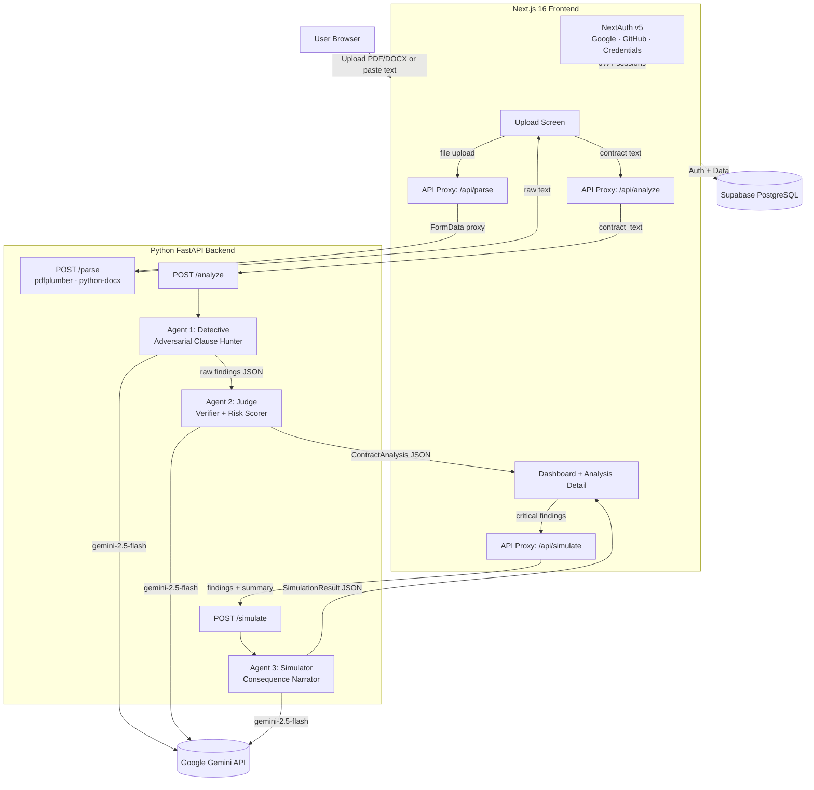

# LexGuard

**Adversarial Multi-Agent AI for Contract Intelligence**


LexGuard is an AI-powered contract analysis platform that uses three adversarial Gemini 2.5 Flash agents working in sequence to detect exploitative clauses, verify findings, and simulate worst-case consequences. Unlike single-prompt summarizers, LexGuard's adversarial design — two agents arguing about the same document — catches edge cases a single pass would miss.

> **Screenshot: Hero / Landing Page**
>
> 

---

## Table of Contents

- [Features](#features)
- [Screenshots](#screenshots)
- [System Architecture](#system-architecture)
- [Tech Stack](#tech-stack)
- [Getting Started](#getting-started)
- [Environment Variables](#environment-variables)
- [Project Structure](#project-structure)
- [Database Schema](#database-schema)
- [API Reference](#api-reference)
- [Deployment](#deployment)
- [Design System](#design-system)
- [License](#license)

---

## Features

- **3-Agent Adversarial Pipeline** — Detective hunts risky clauses, Judge verifies and scores them, Simulator generates worst-case narratives
- **Multi-Format Upload** — Drag-and-drop PDF, DOCX, or paste raw text (up to 20K characters)
- **Risk Scoring** — Quantified 0-100 risk score with severity breakdown (Critical / High / Medium / Low)
- **Clause Highlighting** — Predatory clauses marked directly on the contract text with color-coded severity
- **Worst-Case Simulator** — On-demand second-person consequence stories for high-risk clauses
- **OAuth + Credentials Auth** — Sign in with Google, GitHub, or email/password via NextAuth v5
- **User Profiles** — Avatar upload, editable name, plan management, password change
- **Contract Management** — Grid/list views, search, sort, filter by risk level
- **Data Export** — Download all analyses as JSON
- **Plans & Pricing** — Free tier (10 analyses/day) and Pro tier ($5/month, unlimited)
- **Responsive Design** — Neo-brutalist UI with Tailwind CSS v4, print-ready reports

---

## Screenshots

> **Dashboard — Recent analyses, risk overview, quick stats**
>
> 

> **Upload — Drag-and-drop PDF/DOCX or paste contract text**
>
> 

> **Analysis Detail — Two-pane risk workbench with clause highlighting**
>
> 

> **Contracts — Grid/list view, search, filter by risk level**
>
> 

> **Worst-Case Simulator — AI-generated consequence narratives**
>
> 

> **Profile — Avatar, plan, auth provider, password management**
>
> 

> **Plans & Pricing — Free vs Pro tier comparison**
>
> 

> **Sign In — OAuth (Google, GitHub) + credentials**
>
> 

---

## System Architecture

> **System Design Diagram**
>
> Generate this diagram using [**Eraser.io**](https://eraser.io) (recommended — supports Mermaid, has AI diagram generation) or paste the Mermaid code below into [mermaid.live](https://mermaid.live) to export as PNG/SVG.
>
> 

<details>
<summary><b>Mermaid source (click to expand)</b></summary>



</details>

### Agent Pipeline

| Agent | File | Role | Temp | Output |
|---|---|---|---|---|
| **Detective** | `backend/detective.py` | Scans for every clause that could harm the signer. Classifies into 13 risk categories. | 0.1 | Raw `Finding[]` |
| **Judge** | `backend/judge.py` | Independently verifies each finding against the source. Confirms, upgrades, downgrades, or dismisses. Computes risk score. | 0.1 | Full `ContractAnalysis` |
| **Simulator** | `backend/simulate.py` | Generates vivid worst-case consequence stories for critical/high findings. | 0.7 | `SimulationResult` |

### Risk Scoring Formula

```
overall_risk_score = min(CRITICAL x 25 + HIGH x 10 + MEDIUM x 5 + LOW x 1, 100)
```

| Score | Level |
|---|---|
| 0 - 19 | SAFE |
| 20 - 39 | LOW |
| 40 - 59 | MEDIUM |
| 60 - 79 | HIGH |
| 80 - 100 | CRITICAL |

---

## Tech Stack

| Layer | Technology | Purpose |
|---|---|---|
| Frontend | **Next.js 16** + **React 19** | App Router, SSR, API proxies |
| Styling | **Tailwind CSS v4** | Utility-first CSS, neo-brutalist design system |
| Auth | **NextAuth v5** | Google, GitHub, Credentials providers (JWT sessions) |
| Icons | **Lucide React** | UI icon set |
| File Upload | **react-dropzone** | Drag-and-drop interface |
| Backend | **FastAPI** | REST API, agent orchestration |
| AI | **Gemini 2.5 Flash** | All three agents via `google-genai` SDK |
| Database | **Supabase** (PostgreSQL) | Users, documents, analyses, findings, simulations |
| Deployment | **Google Cloud Run** | Single-container Docker (Node 22 + Python 3.11) |

---

## Getting Started

### Prerequisites

- **Node.js** >= 22
- **Python** >= 3.11
- **npm** (comes with Node.js)
- A **Google Gemini API key** ([Get one here](https://aistudio.google.com/app/apikey))
- A **Supabase** project ([Create one here](https://supabase.com))

### 1. Clone the repository

```bash
git clone https://github.com/your-username/lexguard.git
cd lexguard
```

### 2. Install frontend dependencies

```bash
npm install
```

### 3. Install backend dependencies

```bash
cd backend
pip install -r requirements.txt
cd ..
```

### 4. Set up environment variables

Create a `.env.local` file in the project root:

```bash
cp .env.example .env.local
# Edit .env.local with your actual keys (see Environment Variables section)
```

### 5. Start the development servers

**Terminal 1 — Backend:**
```bash
cd backend
uvicorn main:app --host 0.0.0.0 --port 8000 --reload
```

**Terminal 2 — Frontend:**
```bash
npm run dev
```

Open [http://localhost:3001](http://localhost:3001) in your browser.

---

## Environment Variables

Create a `.env.local` file with the following:

```env
# Google Gemini
GEMINI_API_KEY=your_gemini_api_key

# Python backend URL
BACKEND_URL=http://localhost:8000

# NextAuth.js
NEXTAUTH_URL=http://localhost:3001
NEXTAUTH_SECRET=generate-with-openssl-rand-base64-32

# Google OAuth
GOOGLE_CLIENT_ID=your_google_client_id
GOOGLE_CLIENT_SECRET=your_google_client_secret

# GitHub OAuth
GITHUB_CLIENT_ID=your_github_client_id
GITHUB_CLIENT_SECRET=your_github_client_secret

# Supabase
NEXT_PUBLIC_SUPABASE_URL=https://your-project.supabase.co
NEXT_PUBLIC_SUPABASE_ANON_KEY=your_anon_key
SUPABASE_SERVICE_ROLE_KEY=your_service_role_key
```

---

## Project Structure

```
lexguard/
├── app/
│   ├── (marketing)/
│   │   └── page.tsx                  # Landing page
│   ├── (app)/
│   │   ├── layout.tsx                # Authenticated layout with sidebar
│   │   ├── dashboard/page.tsx        # Dashboard — recent analyses, stats
│   │   ├── upload/page.tsx           # Contract upload screen
│   │   ├── contracts/page.tsx        # Contract list — grid/list, search, filter
│   │   ├── analysis/[id]/page.tsx    # Analysis detail — two-pane risk workbench
│   │   ├── profile/page.tsx          # User profile — avatar, plan, password
│   │   ├── settings/page.tsx         # Settings — theme, export, delete account
│   │   └── plans/page.tsx            # Plans & pricing
│   ├── auth/
│   │   ├── signin/page.tsx           # Sign in (OAuth + credentials)
│   │   └── signup/page.tsx           # Sign up (email + password)
│   ├── api/
│   │   ├── analyze/route.ts          # Proxy → backend /analyze + persist to DB
│   │   ├── parse/route.ts            # Proxy → backend /parse
│   │   ├── simulate/route.ts         # Proxy → backend /simulate
│   │   ├── analyses/
│   │   │   ├── route.ts              # GET all user analyses
│   │   │   └── [id]/route.ts         # GET/DELETE single analysis
│   │   ├── auth/signup/route.ts      # Credentials signup
│   │   └── user/
│   │       ├── profile/route.ts      # GET/PATCH/DELETE user profile
│   │       ├── password/route.ts     # PATCH password
│   │       └── export/route.ts       # GET data export (JSON)
│   ├── globals.css                   # Design system + Tailwind imports
│   └── layout.tsx                    # Root layout
├── components/
│   ├── ContractUpload.tsx            # Drag-drop + paste textarea
│   ├── FindingCard.tsx               # Clause card (severity, verdict, tips)
│   ├── FindingsList.tsx              # Filtered + sorted findings
│   ├── RiskScoreBadge.tsx            # SVG circular risk meter (0-100)
│   ├── SimulatePanel.tsx             # Worst-case scenario panel
│   ├── SummaryStats.tsx              # Severity count breakdown
│   └── layout/
│       ├── Sidebar.tsx               # Navigation sidebar
│       └── UserMenu.tsx              # User dropdown menu
├── lib/
│   ├── auth.ts                       # NextAuth v5 config + JWT callbacks
│   ├── constants.ts                  # Route constants
│   └── supabase/
│       └── server.ts                 # Supabase server client
├── types/
│   └── analysis.ts                   # Shared TypeScript interfaces
├── backend/
│   ├── main.py                       # FastAPI app, CORS, endpoints
│   ├── parser.py                     # PDF + DOCX + plaintext extraction
│   ├── detective.py                  # Agent 1: clause hunter
│   ├── judge.py                      # Agent 2: verifier + scorer
│   ├── simulate.py                   # Agent 3: consequence narrator
│   ├── gemini_client.py              # Gemini API client wrapper
│   └── requirements.txt              # Python dependencies
├── middleware.ts                      # Route protection (auth redirects)
├── Dockerfile                        # Multi-stage build (Node 22 + Python 3.11)
├── start.sh                          # Container entrypoint (backend + frontend)
├── next.config.ts                    # Next.js config (standalone output, 20MB body limit)
└── ARCHITECTURE.md                   # Detailed architecture document
```

---

## Database Schema

> **Entity-Relationship Diagram**
>
> Generate this ER diagram using [**Eraser.io**](https://eraser.io) (best for clean technical diagrams — paste the schema description and let its AI generate the ER diagram) or [**dbdiagram.io**](https://dbdiagram.io) (free, paste DBML syntax). For a quick AI-generated option, use [**ChatGPT**](https://chatgpt.com) or [**Claude**](https://claude.ai) with the prompt: *"Generate a clean ER diagram for these tables: users, documents, analyses, findings, simulations"* and export the artifact.
>
> 

<details>
<summary><b>DBML schema for dbdiagram.io (click to expand)</b></summary>

```dbml
Table users {
  id uuid [pk]
  email text [unique, not null]
  name text
  avatar_url text
  auth_provider text [note: 'google | github | credentials']
  plan text [default: 'free', note: 'free | pro']
  password_hash text
  created_at timestamptz [default: `now()`]
}

Table documents {
  id uuid [pk, default: `gen_random_uuid()`]
  user_id uuid [ref: > users.id]
  file_name text
  detected_type text
  contract_text text
  char_count int
  created_at timestamptz [default: `now()`]
}

Table analyses {
  id uuid [pk, default: `gen_random_uuid()`]
  document_id uuid [ref: > documents.id]
  user_id uuid [ref: > users.id]
  risk_score int
  risk_level text [note: 'SAFE | LOW | MEDIUM | HIGH | CRITICAL']
  judge_confidence float
  contract_summary text
  total_findings int
  critical_count int
  high_count int
  medium_count int
  low_count int
  false_positives_removed int
  created_at timestamptz [default: `now()`]
}

Table findings {
  id uuid [pk, default: `gen_random_uuid()`]
  analysis_id uuid [ref: > analyses.id]
  finding_ref text
  title text
  category text
  severity text [note: 'CRITICAL | HIGH | MEDIUM | LOW']
  clause_text text
  clause_location text
  detective_finding text
  judge_verdict text
  plain_english_impact text
  recommendation text [note: 'ACCEPT | NEGOTIATE | REJECT']
  negotiation_tip text
  verified boolean
  false_positive boolean
  sort_order int
}

Table simulations {
  id uuid [pk, default: `gen_random_uuid()`]
  analysis_id uuid [ref: > analyses.id]
  worst_case_story text
  financial_risk text
  created_at timestamptz [default: `now()`]
}
```

</details>

---

## API Reference

### FastAPI Backend

| Method | Endpoint | Description |
|---|---|---|
| `GET` | `/health` | Health check |
| `POST` | `/parse` | Extract text from PDF/DOCX (`multipart/form-data`) |
| `POST` | `/analyze` | Run Detective + Judge pipeline (`{ contract_text }`) |
| `POST` | `/simulate` | Run Simulator on findings (`{ findings, contract_summary }`) |

### Next.js API Routes

| Method | Endpoint | Description |
|---|---|---|
| `POST` | `/api/parse` | Proxy to backend `/parse` |
| `POST` | `/api/analyze` | Proxy to backend `/analyze` + persist to Supabase |
| `POST` | `/api/simulate` | Proxy to backend `/simulate` |
| `GET` | `/api/analyses` | List all analyses for authenticated user |
| `GET` | `/api/analyses/:id` | Get single analysis with findings |
| `DELETE` | `/api/analyses/:id` | Delete analysis and associated data |
| `POST` | `/api/auth/signup` | Register with email + password |
| `GET` | `/api/user/profile` | Get user profile |
| `PATCH` | `/api/user/profile` | Update name / avatar |
| `DELETE` | `/api/user/profile` | Delete account + all data |
| `PATCH` | `/api/user/password` | Change password (credentials users) |
| `GET` | `/api/user/export` | Export all user data as JSON |

---

## Deployment

### Google Cloud Run (Production)

LexGuard ships as a **single Docker container** running both the Next.js frontend and FastAPI backend, managed by a shell script entrypoint.

```bash
# Set your project
PROJECT_ID=$(gcloud config get-value project)

# Build and push the container
gcloud builds submit . --tag gcr.io/$PROJECT_ID/lexguard

# Deploy to Cloud Run
gcloud run deploy lexguard \
  --image gcr.io/$PROJECT_ID/lexguard \
  --platform managed \
  --region us-central1 \
  --allow-unauthenticated \
  --memory 1Gi \
  --cpu 2 \
  --timeout 120 \
  --set-env-vars "\
GEMINI_API_KEY=your_key,\
NEXTAUTH_URL=https://your-service-url.run.app,\
NEXTAUTH_SECRET=your_secret,\
GOOGLE_CLIENT_ID=your_id,\
GOOGLE_CLIENT_SECRET=your_secret,\
GITHUB_CLIENT_ID=your_id,\
GITHUB_CLIENT_SECRET=your_secret,\
NEXT_PUBLIC_SUPABASE_URL=https://your-project.supabase.co,\
NEXT_PUBLIC_SUPABASE_ANON_KEY=your_anon_key,\
SUPABASE_SERVICE_ROLE_KEY=your_service_role_key"
```

### Alternative: Split Deployment

| Component | Platform | Notes |
|---|---|---|
| Frontend | **Vercel** | Zero-config Next.js hosting. Set `BACKEND_URL` env var. |
| Backend | **Render** | Connect repo, set `GEMINI_API_KEY`. Auto-detects Dockerfile. |

```bash
# Deploy frontend to Vercel
npm i -g vercel && vercel --prod

# Backend on Render: connect repo via dashboard
# Set env: GEMINI_API_KEY=your_key
```

---

## Design System

LexGuard uses a **Retro Neo-Brutalist** visual language:

- **Borders:** Hard 2-3px solid black borders, no border-radius
- **Shadows:** Offset box shadows (`4px 4px 0px #1a1a1a`)
- **Typography:** Bold uppercase headings, monospace accents
- **Color Palette:**

| Swatch | Color | Hex | Usage |
|---|---|---|---|
|  | Sand | `#f5f4f0` | Page backgrounds |
|  | Ink | `#1a1a1a` | Text, borders, shadows |
|  | Lilac | `#d2c4fb` | Active states, primary accent |
|  | Yellow | `#ffe082` | Pro tier, highlights, warnings |
|  | Coral | `#ff8a80` | Danger, critical severity |
|  | Mint | `#a7ffeb` | Success, safe severity |

> **Design System in Action**
>
> 

---

## License

This project is proprietary. All rights reserved.
